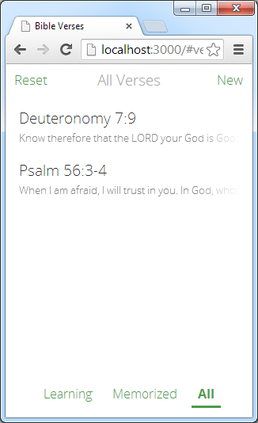

Bible memory verse app, which works offline using AppCache and LocalStorage.



## Setup

```
npm install
```

## Running

- Run `npm start` for server.
- Run `npm run develop` for server and watch task, with AppCache disabled.
- Open `http://localhost:3000`.

## Deploying

```
git push heroku master
heroku open
```

## Credits

Basis for the Bible icon designed by [Bruno Gätjens González](http://www.thenounproject.com/gatjensb) from the [Noun Project](http://www.thenounproject.com).